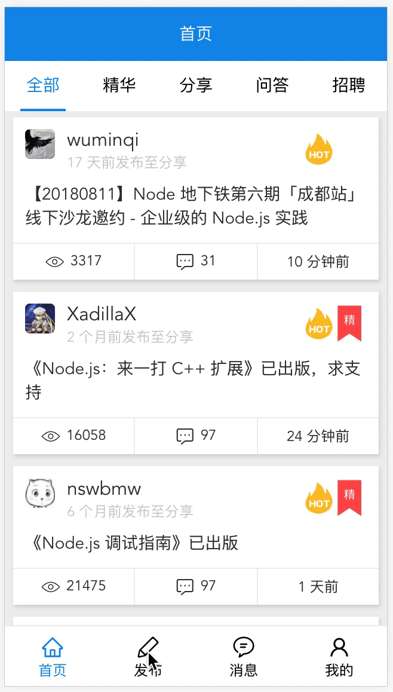
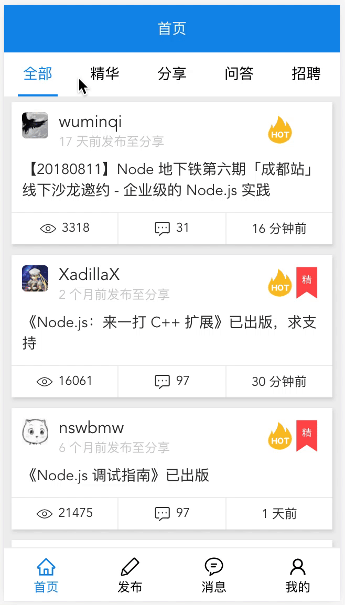

### 扫一扫在线预览

### gif 先感受下

#### 技术栈

> 脚手架@vue/cli@3.0.1 vue 全家桶, typescript, scss

#### 主要功能

- [x] 首页
- [x] 发布
- [x] 消息
- [x] 用户中心
- [x] 话题详情页
- [x] 用户详情页

#### feature

- [x] 所有文章的浏览位置记录
- [x] 查看过的文章缓存
- [x] 查看过的用户缓存
- [x] 回复文章
- [x] 支持(文章详情页头部(用户名)、文章详情页内@用户、评论@用户)用户跳转 所有地方的用户跳转
- [x] 代码高亮
- [x] 图片放大预览
