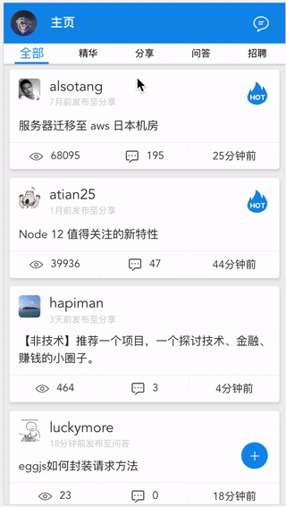
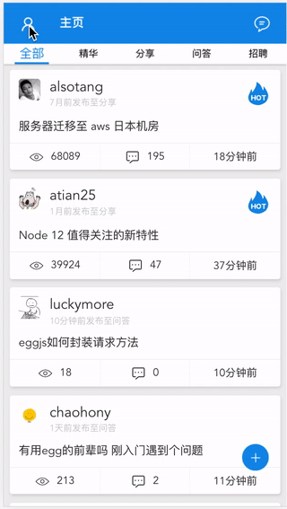
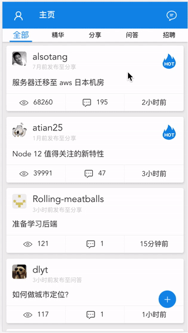

[![node][node]][node-url]
[![vue-cli][vue-cli]][vue-cli-url]
[![typescript][typescript]][typescript-url]

### 扫一扫在线预览

#### 技术栈

> 脚手架@vue/cli@3.0.1 vue 全家桶, typescript, scss

#### 主要功能

- [x] 首页
- [x] 发布
- [x] 消息
- [x] 用户中心
- [x] 话题详情页
- [x] 用户详情页

#### feature

- [x] 所有文章的浏览位置记录
- [x] 查看过的文章缓存
- [x] 查看过的用户缓存
- [x] 回复文章
- [x] 支持(文章详情页头部(用户名)、文章详情页内@用户、评论@用户)用户跳转 所有地方的用户跳转
- [x] 代码高亮
- [x] 图片放大预览

#### next

- [x] topics 左右滑动切换 tab
- [x] 优化滑动体验
- [x] 骨架屏
- [x] 图片懒加载
- [x] 扫码登录
- [x] tabbar 改为侧边栏 (扩大可视区)
- [ ] 夜间模式

## License

[MIT](./LICENSE)

[node]: https://img.shields.io/badge/node-%3E=v8.9.0-brightgreen.svg
[node-url]: https://nodejs.org
[vue-cli]: https://img.shields.io/badge/%40vue%2Fcli-3.0.1-brightgreen.svg
[vue-cli-url]: https://cli.vuejs.org
[typescript]: https://img.shields.io/badge/typescript-2.9.1-brightgreen.svg
[typescript-url]: http://www.typescriptlang.org
